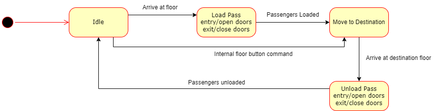

# SYSC3303 Elevator 
___
This repository is for the SYSC3303 Elevator Group Project.

## Table of Contents
___
- Description
  - UML Class Diagram
  - UML Sequence Diagram
  - Elevator State Diagram
  - Scheduler State Diagram
- Getting started
  - Prerequisites
  - Setup
  - Usage
- To Do
- Credits

## Description
___
The project is composed of an elevator control system and simulator. The system consists of an
elevator controller (the Scheduler), a simulator for the elevator cars (which includes, the lights, buttons, doors
and motors) and a simulator for the floors. The elevator controller is multi-threaded, and the simulation is configurable in terms of the number of floors,
the number number of elevators, the time it takes to open and close the doors, and the time it takes to move
between floors. These values are stored in a CSV file located in src.

### UML Class Diagram


### UML Sequence Diagram


### Elevator State Diagram


### Scheduler State Diagram


## Geting Started
___
### Prerequisites
Ensure that you have Java installed on your system.
The test classes for this project use JUnit 5.
JUnit 5 requires Java 8 (or higher) at runtime. 

### Setup
Add tasks to the csv file with the name "ElevatorCallSheet - Sheet1.csv" in the src folder with the following format:

    Time,Floor,Floor Button,Car Button
    hh:mm:ss.mmm,n,Up/Down,n

    Followed by the values in rows below it ordered by time
    Example CSV file:

    Time,Floor,Floor Button,Car Button
    hh:mm:ss.mmm,n,Up/Down,n
    14:05:15,2,Up,4
    15:06:05,4,Down,1
    19:00:00,1,Up,2
    22:25:55,3,Down,2

### Usage
First, open your terminal and navigate to the project's root directory. Then do the following:
1. Compile all Java files:

```javac -d out -cp src src/**/*.java```

2. Run the program:

```java Main```

### To Do
___
Integrate elevator and button panel GUIs with the scheduler.

Implement algorithm to manage elevator tasks with two or more elevators:
- One elevator should wait (start) at the bottom, and the other elevator should wait (start) at the top. For now, we will just implement one elevator that starts at the bottom floor.
- Group tasks with the same direction into a sub-queue in the scheduler. The scheduler maintains two seperate sub-queues - one for each direction.
- The elevator closest to the head of a sub-queue gets assigned the sub-queue in its own seperate elevator task queue. The sub-queue for that direction in the scheduler gets cleared.
- The elevator stops at all requested floors and destination floors along the way.
- New tasks can be added to the elevator's queue from the scheduler if the floor making the request is between the elevator's current location and the tail, and the request is in the same direction that the elevator is travelling. Otherwise, every new task will be put in the appropriate sub-queue.
- The elevator moves in one direction until all tasks in its own queue are serviced.
- When all tasks in the elevator's queue are serviced, notify the scheduler, and accept the scheduler's new sub-queue with closest head. If there are no more sub-queues, the elevator returns to its start position and notifies the scheduler of its state.

The algorithm should optimize throughput if more than two cars are used by changing how tasks are classified and dispatched in the scheduler.

## Credits
___

- Jestan Brar

- Daniel Godfrey

- Ibtasam Rasool

- Saad Sheikh

- Quinton Tracey 


